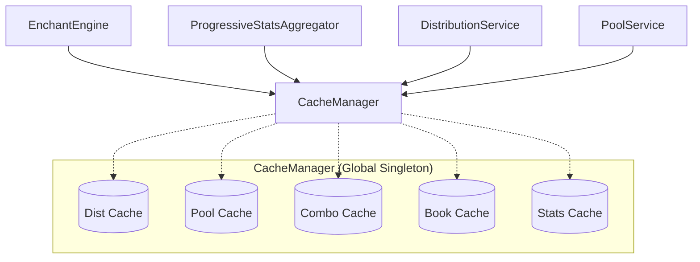
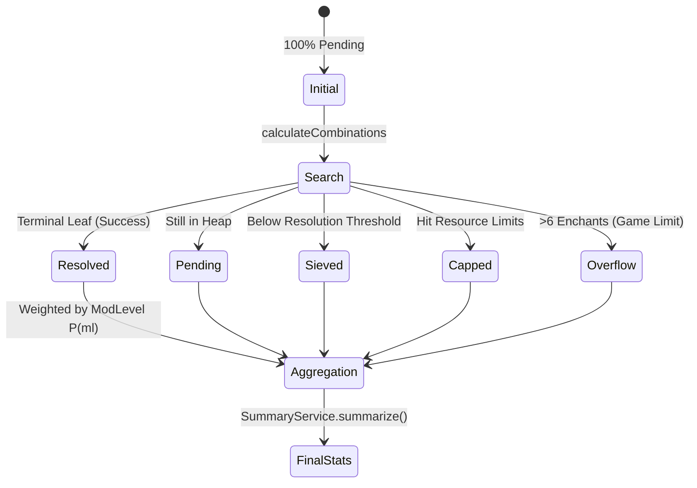

# Architecture Map — Minecraft Enchantment Analyzer (v3)

## Entry Points

| Entry point | Purpose |
|---|---|
| `src/lib/index.ts` | Public library API — re-exports engine, registry, data, types, utils |
| `src/ui/index.ts` | Browser UI bundle entry — wires DOM, workers, chart, refinement |
| `src/worker/worker.ts` | Web Worker entry — runs engine off the main thread |

---

## Module Dependency Graph

```
src/lib/
  constants/       ← Minecraft rules, XP caps, search limits (new)
  data/            ← pure JSON-shaped data (no imports)
  types/           ← type definitions only (no runtime deps)
  utils/           ← stateless math, BinaryHeap, LRUCache, etc.
  core/            ← RegistryFactory, builder logic
  engine/          ← EnchantEngine, SearchStateTracker, SearchService, etc.
  services/        ← CacheManager, SummaryService, HumanizationService, etc.
  index.ts         ← Public library API (re-exports)

src/ui/            ← UI layer only
  index.ts         ← UI bundle entry
  analyzer.html     ← Entry template
  ... (ResultsView, ChartController, Refinement, etc.)

src/worker/
  worker.ts        ← Web Worker entry

tests/             ← Root-level test suite
  unit/            ← Logic isolation tests
  integration/     ← Cross-module flow tests
  snapshots/       ← Mathematical gold standards

scripts/           ← Build, profiling, snapshot tools
  ... (benchmark_engine.ts, update-snapshots.ts, etc.)
```

Dependency direction: `lib/constants` ← `lib/data` ← `lib/types` ← `lib/utils` ← `lib/core` ← `lib/engine` ← `lib/services` ← `worker` ← `ui`
(Each layer imports only from layers to its left, with one noted exception: `engine/aggregation/ProgressiveStatsAggregator.ts` imports `SummaryService` from `services` for inline progress callbacks.)

---

## Data Flow: Input → Engine → Worker → UI

```
User input (version, category, material, xp, guaranteedFirst)
    │
    ▼
UI (src/ui/index.ts)
  WorkerClient.request('getFullStats', payload)   ← sends message to Web Worker
    │
    ▼  [postMessage over structured clone]
    ▼
Worker (src/worker/worker.ts)
  engine.getFullStats(cat, xp, mat, config)
    │
    ▼
EnchantEngine.getFullStats (src/lib/engine/index.ts)
  ├─ validates inputs (xp range, known category/material, guaranteed-first validity)
  ├─ checks CacheManager (stats cache, threshold-aware hit detection)
  └─ ProgressiveStatsAggregator.getFullStats(registry, cat, xp, mat, guaranteedFirst, config)
        │
        ├─ ModifiedLevelDistributionService.getModifiedLevelDist(version, xp, enchantability)
        │    → bigint probability map  { modifiedLevel → P(level) }
        │
        └─ for each modifiedLevel (highest→lowest):
             SearchService.calculateCombinations(registry, cat, ml, mat, ...)
                ├─ CacheManager (combo/book cache hit/resumption detection)
                ├─ FrontierFactory.create()   → initialises BinaryHeap + mass maps
                ├─ SearchProcessor: high-speed search primitives
                ├─ best-first search loop (using SearchStateTracker)
                ├─ SearchProcessor.redistributeBookProb() → split prob for multi-enchant books
                └─ returns SearchFrontier { results, anyMass, rankMass, countMass, accounting (ProbabilityMassBookkeeper) }

        ↓ accumulate frontier results weighted by modLevel probabilities
        SummaryService.summarize()   → CalculationStats { ..., accuracy, accounting, threshold }
    │
    ▼
CacheManager.setStats(version, key, CalculationStats)
    │
    ▼
SerializationService.serialize()   → CompactStats (TypedArrays for transferable transfer)
    │
    ▼  [postMessage + transferables]
WorkerClient (src/ui/worker-client.ts)
  SerializationService.deserialize() → CalculationStats
    │
    ├─ onProgress callback → intermediate UI update
    └─ final result
    │
    ▼
UI (HumanizationService.humanize + ResultsChartController + RefinementController)
```

---

## Key Function Signatures

### `src/lib/engine/index.ts` — `EnchantEngine`
| Signature | What it does |
|---|---|
| `constructor(data, version)` | Builds registry from DATA + version string; throws for invalid inputs |
| `getFullStats(cat, xp, mat, config?) → Promise<CalculationStats>` | Main public API: validates inputs (non-starter check), aggregates stats |
| `calculateCombinations(cat, modLevel, mat, guaranteedFirst?, threshold?, maxIterations?, resultsLimit?) → SearchFrontier` | Runs best-first search for a single modified level; wraps SearchService with cache |
| `getModifiedLevelDist(xp, enchantability) → {[level]: bigint}` | Returns probability distribution over modified enchantment levels |
| `getEligibleListNumeric(cat, level, mat, bitset?) → number[]` | Returns packed enchant IDs eligible at a level, excluding the given bitset |
| `static clearAllCaches()` | Clears all caches across all live engines (keeps engine registry intact) |
| `static clearAllEngines()` | Clears all caches AND removes all engine refs from the global tracking set |
| `destroy()` | Clears caches and removes this engine from the global tracking set |

### `src/lib/engine/aggregator.ts` — `ProgressiveStatsAggregator`
| Signature | What it does |
|---|---|
| `static getFullStats(registry, cat, xp, mat, guaranteedFirst?, config?) → Promise<CalculationStats>` | Loops over all modified levels, runs search per level, accumulates weighted mass maps |

### `src/lib/engine/distribution.ts` — `DistributionService`
| Signature | What it does |
|---|---|
| `static getModifiedLevelDist(xp, enchantability, registry, cache?) → {[level]: bigint}` | Computes triangular distribution of modified levels using BigInt fixed-point arithmetic |

### `src/lib/engine/search.ts` — `SearchService`
| Signature | What it does |
|---|---|
| `static calculateCombinations(registry, cat, modLevel, mat, guaranteedFirst?, threshold?, limit, existingFrontier?, resultsLimit?, poolCache?, instrumentation?, floor?) → SearchFrontier` | Best-first iterative search; resumes from existing frontier if provided; uses ProbabilityMassBookkeeper for bookkeeping |

### `src/lib/engine/frontier.ts` — `FrontierFactory`
| Signature | What it does |
|---|---|
| `static create(registry, cat, modLevel, guaranteedFirst?, existing?, threshold?) → SearchFrontier` | Creates a fresh frontier (with guaranteed-first seed) or deep-clones an existing one |
| `static getGuaranteedFirstId(registry, guaranteedFirst) → number \| null` | Resolves a "Name Rank" string to enchantment ID, returns null if unknown |

### `src/lib/core/factory.ts` — `RegistryFactory`
| Signature | What it does |
|---|---|
| `static build(data, version) → RegistryState` | Builds full registry by resolving version inheritance chain, applying overrides, building ID maps |

### `src/lib/core/registry.ts` — lookup functions
| Signature | What it does |
|---|---|
| `getCategoryId(state, cat) → number` | Returns numeric category ID, or UNKNOWN_CATEGORY_ID (63) if not found |
| `getMaterialId(state, mat) → number` | Returns numeric material ID, or UNKNOWN_MATERIAL_ID (63) if not found |
| `getEnchantId(state, name) → number` | Returns numeric enchantment ID, or UNKNOWN_ENCHANT_ID (255) if not found |
| `isCategoryAvailable(state, cat) → boolean` | True if the category has any enchantments in this version's pool |
| `getEligiblePool(state, cat, level, mat, cache?) → PackedEnchant[]` | Returns packed (id<<8\|rank) list of eligible enchants at the given level |
| `isEnchantmentAchievable(state, fullName, cat, mat, levels, cache?) → boolean` | Checks if a named enchantment appears in any pool for the given levels |
| `getEnchantability(state, mat, cat) → number` | Returns base enchantability value for a material+category combination |

### `src/lib/services/SummaryService.ts`
| Signature | What it does |
|---|---|
| `static summarize(combos, accountant, anyMass?, rankMass?, countMass?, comboLimit?) → CalculationStats` | Converts raw BigInt mass maps and ProbabilityMassBookkeeper into a number-based CalculationStats object |

### `src/lib/services/HumanizationService.ts`
| Signature | What it does |
|---|---|
| `static humanize(stats, resolver, sortMode?, romanMap?) → EnchantInsights` | Translates numeric IDs and hex combo keys into human-readable names |

### `src/lib/services/SerializationService.ts`
| Signature | What it does |
|---|---|
| `static serialize(stats) → { compact: CompactStats, transferables: Transferable[] }` | Packs CalculationStats into typed arrays for zero-copy postMessage transfer |
| `static deserialize(compact) → CalculationStats` | Reconstructs CalculationStats from typed array representation |


### `src/worker/client.ts` — `WorkerClient`
| Signature | What it does |
|---|---|
| `init(version) → Promise<void>` | Spawns two Web Workers (main + chart) and initialises each with the given version |
| `request(type, payload, onProgress?, workerTarget?) → Promise<WorkerResult>` | Sends a typed request to the chosen worker; resolves with final stats |

---

## Key Constants (`src/lib/constants/*.ts`)

| Constant | Source | Meaning |
|---|---|---|
| `MINECRAFT.MAX_XP_LEVEL` | `minecraft.ts` | Maximum XP level (modern 30, legacy 50) |
| `ENGINE.MAX_RESULTS_SIZE` | `engine.ts` | Hard cap on combos stored in a SearchFrontier |
| `ENGINE.CACHE_SIZE_STATS` | `engine.ts` | LRU size for the unified stats cache |

---

## Caching Strategy (CacheManager)

The engine uses a centralized, singleton `CacheManager` to manage memory and lifecycle. All cache keys are **version-prefixed** to prevent cross-version pollution.



### Probability Accounting (ProbabilityMassBookkeeper)

The `ProbabilityMassBookkeeper` unifies mass tracking and residue harvesting into a single class, ensuring 100% mass conservation across the complex branching search.



### statsCache semantics
- Key: `version:getStatsKey(catId, matId, xp, guaranteedId)`
- **Threshold Awareness**: When retrieving from cache, the engine checks if `cached.threshold <= requested.threshold`. If the cached result was generated with *more* precision (lower threshold), it is returned. If not, it is ignored or used as a baseline for further refinement.

## Search Termination & Invariants

The best-first search maintains strict invariants to ensure stability and accuracy:
- **`floor < threshold`**: The engine maintains a system-level `floor` (lower limit) and a user-level `threshold`. Nodes are only branched if `prob > threshold`, but they may be settled into the results map even if below `threshold` as long as they are above `floor`. This ensures that guaranteed enchantments (which may have low probability branches) are still accounted for correctly.
- **Mass Conservation**: Every call to `ProgressiveStatsAggregator.addScaled` ensures that the sum of all buckets matches the input probability, with discrepancies handled by `rounding`.

## Performance & Caching

**comboCache / bookComboCache semantics**
- Key: `getPackedKey(catId, matId, modLevel, guaranteedId)` — `limit` is NOT in the key, enabling cross-tier resumability (a deep tier can resume the frontier cached by a coarser tier)
- Read: if `cached.threshold <= requested threshold`, return cached entry directly; otherwise pass as `existingFrontier` to continue the search
- Write: always overwrite with the latest (more-explored) frontier

### Probability Accounting

The engine uses a rigorous probability accounting system to ensure no probability mass is "lost" during the search. Every possible outcome is categorized into one of the following buckets:

- **Resolved**: Success! The search reached a natural leaf node.
- **Pending**: Uncertain. These are nodes still in the search queue that haven't been processed yet.
- **Sieved**: Discarded. These nodes had a probability below the minimum resolution threshold.
- **Overflow**: Discarded by technical limits. These are outcomes that exceeded the 6-enchantment cap supported by the engine.
- **Capped**: Discarded by engine limits. These are outcomes that were not explored because the results map or search queue reached their maximum allowed size (an engine-resource constraint).
- **Rounding**: Compensation. This bucket tracks the cumulative rounding error from fixed-point (BigInt) arithmetic, ensuring the sum of all buckets is always exactly 1.0 (indexed to `10^12`).

This categorization allows us to distinguish between losses due to game rules (`overflow`) and losses due to engine performance optimizations (`capped` and `sieved`), providing a clear "accuracy" metric (the `resolved` mass).

The `ProbabilityMassBookkeeper` class manages these buckets and provides an `addScaled` method to combine results from multiple tiers or levels while maintaining perfect conservation.

---

**Bit layout of packed keys**

| Bits | Field | Key type |
|------|-------|----------|
| 0–5  | catId | both |
| 6–11 | matId | both |
| 12–19 | modLevel / xp | both |
| 20–27 | guaranteedId | both |
