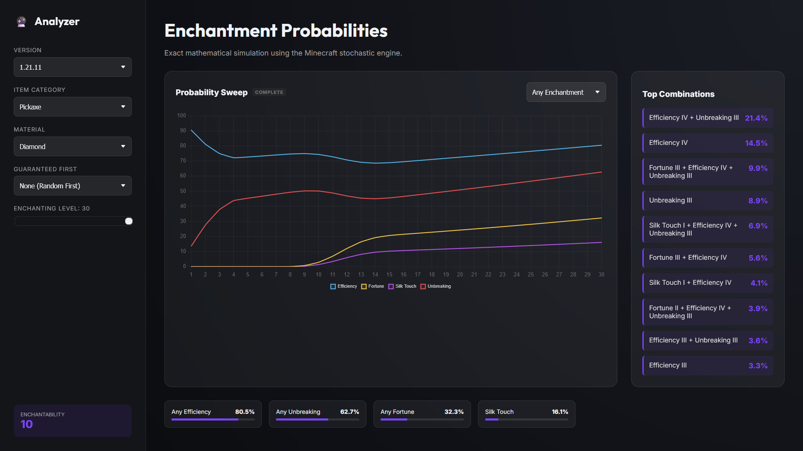

# Minecraft Enchantment Analyzer

A high-performance, real-time simulation tool for Minecraft's enchanting mechanics. This analyzer provides instant, mathematically precise probabilities for any item, material, and version combination.

## ✨ Why use this Analyzer?

- **🚀 Instant Insights**: Get immediate estimates that refine into exact percentages in seconds.
- **📈 Live Charting**: Watch the probability charts update live as the engine explores millions of possible outcomes.
- **💎 Version Perfect**: Supports all major mechanics changes from **Beta 1.9 up to 1.21**, including historical quirks like the 1.14 Protection conflict window.
- **📏 Deep Analysis**: Correctly models up to **6 concurrent enchantments** on a single item, providing better coverage for top-tier gear.
- **📚 Complex Support**: Accurate handling of "Multi-Enchantment" books and secondary enchantment decays that other tools often overlook.

## 🚀 Getting Started

### 📥 Standalone HTML (Zero Install)
The easiest way to use the analyzer is to download the **Standalone HTML** file from our [Releases Page](https://github.com/JonathanBraverDev/mc-enchanting-analyzer/releases).
- **No install needed**: Just open the file in any modern web browser.
- **Portable**: Everything (logic, styles, data) is contained in a single file.

### 🛠️ Developer Setup
If you want to contribute to the engine or run from source:
1. **Clone** the repository.
2. **Install**: `npm install`
3. **Run**: `npm start` (opens the dev server)
4. **Build**: `npm run build` (bundles the modular engine)
5. **Test**: `npm test` (runs the engine, registry, and UI validation suite)

To build your own standalone version, use: `npm run build:standalone`. The result will appear at `dist/analyzer-standalone.html`.

## 🧠 The Engine

This tool uses the V5 checkpoint search engine. It prioritizes the most likely outcomes first, reports useful intermediate checkpoints to the UI, and keeps every probability bucket accounted for while deeper searches continue. Internally, V5 uses a graph-backed node-ID frontier with a fast safe-number identity path for vanilla-sized registries and a BigInt identity path for larger supported registries, so repeated search states share canonical node data instead of carrying full metadata through every frontier operation.

For implementation details, see:
- `ARCHITECTURE.md` for the engine, worker, and checkpoint flow.
- `MASS_HANDLING.md` for probability conservation and accounting.

---
Created by **Jonathan Braver**
